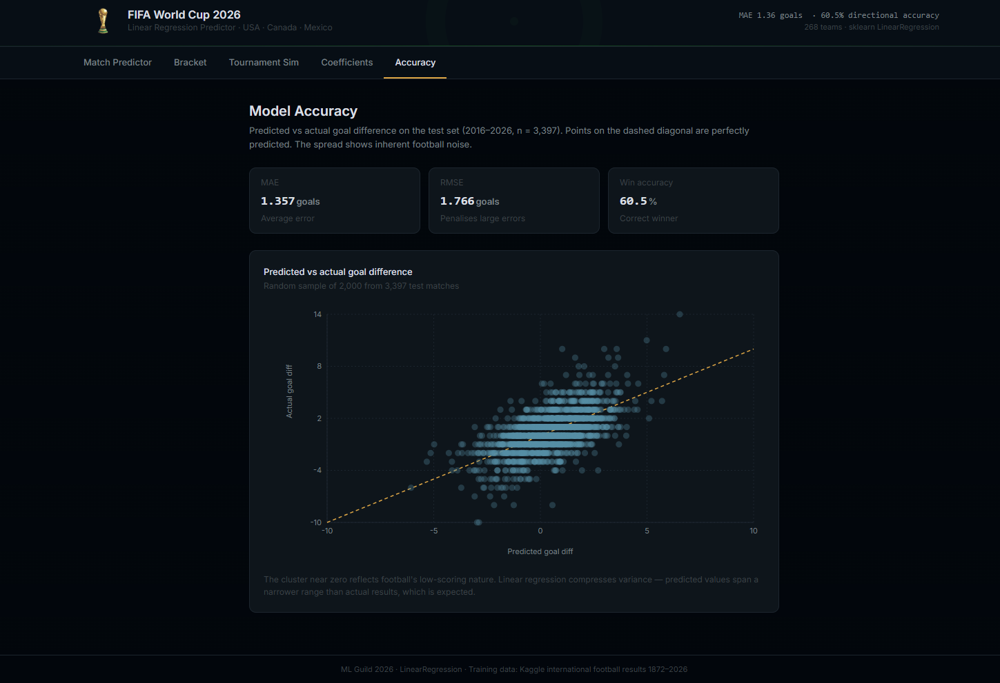

# FIFA World Cup 2026 — Linear Regression Predictor



A machine learning project that predicts match goal differences and simulates a 48-team World Cup tournament using **linear regression**. Training runs in Python; predictions and simulations run entirely in the browser from saved coefficients. No backend or database is required.

> **Model constraint:** `sklearn.linear_model.LinearRegression` only. No classifiers, logistic regression, or neural networks.

**Live demo:** [worldcuplinearml.vercel.app](https://worldcuplinearml.vercel.app/)

## Prediction Results

The project's reported predictions selected **Spain as champion**, Spain and Argentina as finalists, and Spain, Argentina, England, and France as semifinalists. These selections match the tournament outcomes in [FIFA's final standings](https://www.fifa.com/en/tournaments/mens/worldcup/canadamexicousa2026/articles/final-tournament-standings).

| Reported prediction rank | Team | Tournament finish |
|---|---|---|
| 1 |  **Spain** | **Champion** |
| 2 |  Argentina | Runner-up |
| 3 |  England | Third place |
| 4 |  France | Fourth place |

These are project-reported selections, separate from the held-out metrics below. Exact simulation percentages and a dated pre-tournament prediction snapshot are not included here. Fresh simulation runs can produce different rankings because they use random sampling.

## What It Does

| Feature | Description |
|---|---|
| **Match Predictor** | Select two teams and a venue setting to predict goal difference, a derived scoreline, and the likely winner |
| **Bracket Simulator** | Build a manual 2026 bracket with model-powered winner predictions |
| **Tournament Simulation** | Estimate champion probabilities with 1,000, 5,000, 10,000, or 25,000 Monte Carlo runs |
| **Coefficient Chart** | Inspect coefficients for the seven standardized features |
| **Accuracy Chart** | Compare predicted and actual goal differences on the test set |

## How Linear Regression Is Used

### Predict a margin, then derive a result

The training target is a continuous number:

```text
goal_diff = home_score - away_score
prediction = intercept + Σ(coefficient × standardized_feature)
```

A positive prediction favours the home team; a negative prediction favours the away team. The Match Predictor displays a draw for predictions between −0.05 and +0.05 goals, inclusive. This display rule does not turn the trained model into a classifier.

The displayed scoreline is a heuristic derived from the margin, using a baseline of 1.2 goals per team, rounding, and a lower bound of zero. It is not a separately trained score prediction and can show a draw even when the predicted margin favours one team.

Linear regression provides a small, inspectable model that is easy to reproduce in JavaScript. It can still overfit or miss nonlinear relationships. Coefficients describe associations, not causal effects, and correlated features can make individual coefficients difficult to interpret.

### Browser inference

Training exports the coefficients, intercept, scaler parameters, and team snapshots to `model.json`. The browser applies the same calculation:

```javascript
// Feature order must match model.features.
const raw = [form_diff, scored_diff, conceded_diff,
             strength_diff, elo_diff, market_value_diff, neutral];

const scaled = raw.map(
  (x, i) => (x - model.scaling.mean[i]) / model.scaling.scale[i]
);

const goalDiff = model.intercept + scaled.reduce(
  (sum, x, i) => sum + x * model.coef[i], 0
);
```

See [train.py](train.py) and [frontend/src/utils/model.js](frontend/src/utils/model.js).

## Features and Training Data

The first six features are **home minus away** differences. `neutral` is a venue indicator. A positive `conceded_diff` means the home team has conceded more goals, which is generally a disadvantage.

| Feature | Calculation |
|---|---|
| `form_diff` | Difference in weighted win rates over each team's last 10 matches |
| `scored_diff` | Difference in weighted average goals scored over the same window |
| `conceded_diff` | Difference in weighted average goals conceded |
| `strength_diff` | Difference in weighted average goal margins |
| `elo_diff` | Difference in Elo ratings before the match |
| `market_value_diff` | Difference in static squad market values, in € millions |
| `neutral` | 1 for a neutral venue; 0 otherwise |

### Rolling statistics

Recent-match weighting and friendly downweighting are already implemented:

- Each window contains the last **10 matches**, including friendlies.
- The most recent **3 matches receive double weight**.
- Friendly weights are multiplied by **0.25**.
- Weighted averages divide by the sum of the resulting weights.
- Matches are dropped from the feature table if either team lacks 10 prior matches.

Features and Elo ratings are captured before processing each match result. Histories and ratings are updated afterward. `StandardScaler` is fitted only on the training partition.

### Data and evaluation split

- **Results source:** [International Football Results — Kaggle](https://www.kaggle.com/datasets/martj42/international-football-results-from-1872-to-2017).
- **Scope:** Matches from 2000 onward with non-missing scores.
- **Market values:** [data/market_values.csv](data/market_values.csv), a static squad-value lookup attributed to Transfermarkt; missing values default to zero.
- **Split:** Chronological, using the 80th-percentile match date as the cutoff. Matches on the same date stay in the same partition; there is no shuffle.
- **Training:** Includes competitive matches and friendlies.
- **Evaluation:** Uses only competitive matches from the later partition.

Dataset counts and date ranges depend on the downloaded CSV; `train.py` prints them when run.

### Elo updates

Every team starts at 1500. Tournament-name matching chooses the update factor in this order:

| First matching rule | K-factor |
|---|---|
| Name contains `fifa world cup`, `uefa european`, `copa america`, `africa cup of nations`, or `afc asian cup` | 60 |
| Otherwise, name contains `qualif` | 40 |
| All other names, including friendlies | 20 |

Because major-tournament names are checked first, a qualifier containing one of those names also receives K = 60.

## Saved Model Metrics

The checked-in [model.json](model.json) reports these results on **3,397 competitive test matches**:

| Metric | Value |
|---|---|
| MAE | 1.3566 goals |
| RMSE | 1.7662 goals |
| Directional accuracy | 60.49% |
| Residual standard deviation | 1.7657 goals |

**Directional accuracy** is the fraction of matches where `sign(predicted_diff) == sign(actual_diff)`. This uses the raw prediction: an actual draw counts as correct only when the prediction is exactly zero. It differs from the Match Predictor's ±0.05 draw threshold, so it should be read alongside MAE and RMSE.

These values describe the saved model and its test partition, not guaranteed performance on future matches or calibrated tournament-winning probabilities.

## Monte Carlo Simulation

The default run performs **10,000 simulations**:

1. Play six round-robin matches in each of 12 four-team groups.
2. Advance the top two teams per group and the eight best third-place teams.
3. Shuffle the 32 qualifiers and play single-elimination rounds through the final.
4. Divide each team's champion count by the number of simulations to estimate its title probability.

Each simulated match adds Gaussian noise to the regression margin:

```javascript
const sigma = model.metrics?.residual_std ?? 1.98;
const noisyDiff = predictGoalDiff(teamA, teamB, true, model)
                + gaussianRandom(0, sigma);
```

The saved model supplies a residual standard deviation of **1.7657**. The simulator uses 1.98 only when that metric is unavailable. Knockout margins within 0.05 goals of zero are decided by a coin flip.

### Current limitations

- **Simplified tournament rules:** Monte Carlo knockout pairings are shuffled rather than mapped to the official bracket. Group tiebreakers use points, goal difference, and goals scored.
- **Draw handling:** Group points follow the sign of the continuous noisy margin, so exact draws are effectively absent even when the rounded scoreline is level.
- **Neutral venues:** All simulated matches use the neutral setting, including matches involving host nations.
- **Uncertainty:** Gaussian residual noise is an assumption. Matching its spread to test residuals does not establish probability calibration; the test set also supplies the simulation noise estimate.
- **Historical market values:** One static squad-value snapshot is reused across historical matches. This can introduce look-ahead bias, so the complete pipeline should not be described as leakage-free.
- **Correlated inputs:** `strength_diff` is derived from `scored_diff - conceded_diff`, making those features redundant and individual coefficient interpretations less reliable.
- **Fixed team snapshots:** Browser predictions use exported team statistics; they do not update automatically with new results, injuries, or lineups.

## Setup

### Run the frontend

With Node.js and npm installed, use the included model without retraining:

```bash
cd frontend
npm install
npm run dev
```

Open the local URL printed by Vite, normally `http://localhost:5173`.

### Retrain the model

From the repository root, install the Python dependencies:

```bash
python -m pip install -r requirements.txt
```

Download `results.csv` from the Kaggle dataset linked above and place it at `data/results.csv` (gitignored). Then run:

```bash
# Windows: UTF-8 avoids Unicode console encoding errors.
python -X utf8 train.py

# macOS / Linux
python train.py
```

Training runs feature engineering and model fitting, prints evaluation metrics, and writes:

- `artifacts/features_preview.csv` — the generated feature table.
- `model.json` — coefficients, scaling, team snapshots, metrics, and test predictions.
- `frontend/public/model.json` — the model served by the frontend.

### Production build

From `frontend/`:

```bash
npm run build
npm run preview
```

The static build is written to `frontend/dist/`.

## Deployment

For Vercel, import the repository and use these project settings:

| Setting | Value |
|---|---|
| Root directory | `frontend` |
| Framework preset | Vite |
| Build command | `npm run build` |
| Output directory | `dist` |

The exported model is served as a static asset. Retrain and redeploy to publish updated predictions.

## Project Structure

```text
LinearRegression_Guild_Model/
├── data/
│   ├── results.csv              # User-provided, gitignored match data
│   └── market_values.csv        # Static squad market values
├── train.py                     # Feature engineering, training, evaluation
├── model.json                   # Saved model and team snapshots
├── artifacts/
│   └── features_preview.csv     # Generated feature table
├── img/
│   └── cover.png
├── frontend/
│   ├── public/model.json       # Browser-served copy of the model
│   ├── src/
│   │   ├── App.jsx
│   │   ├── components/
│   │   │   ├── MatchPredictor.jsx
│   │   │   ├── CustomBracket.jsx
│   │   │   ├── TournamentSim.jsx
│   │   │   ├── CoeffChart.jsx
│   │   │   └── ScatterPlot.jsx
│   │   └── utils/
│   │       ├── model.js        # Regression inference and scoreline helpers
│   │       ├── tournament.js   # Group definitions and Monte Carlo engine
│   │       └── flags.js        # Country flag helpers
│   └── package.json
├── docs/superpowers/
│   ├── specs/
│   └── plans/
└── requirements.txt
```

## Future Improvements — Linear Regression Only

Recent-match weighting and friendly downweighting are already present. Further experiments should be evaluated on chronological validation periods, with a separate final test period:

1. Use historically dated squad values, or compare against a model without market values.
2. Remove redundant features and measure whether performance and coefficient stability improve.
3. Compare competitive-only training and rolling histories against the current friendly weighting.
4. Compare 10-, 15-, and 20-match rolling windows.
5. Evaluate past-only head-to-head features and selected interaction terms as additional `LinearRegression` inputs.
6. Improve simulation fidelity with consistent draw handling, official bracket mapping, and probability-calibration checks.

Changing from `StandardScaler` to `RobustScaler` alone does not make ordinary least squares robust to outliers: both are affine feature transformations, so predictions with an intercept are generally equivalent apart from numerical effects.

The [earlier accuracy-upgrade plan](docs/superpowers/plans/2026-06-14-model-accuracy-upgrade.md) provides historical design context; some proposed changes have already been implemented or differ from the current code.

## Tech Stack

| Layer | Technology |
|---|---|
| Training | Python, pandas, NumPy, scikit-learn |
| Frontend | React 18, Vite, Tailwind CSS |
| Charts | Recharts |
| Hosting | Vercel, static deployment |
